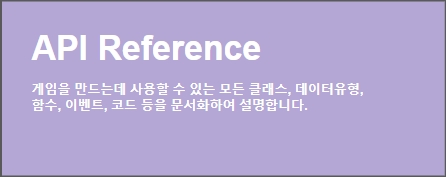

# HOME

<table>
  <thead>
    <tr>
      <th style="text-align:left">
        
 
           <a href="studio-manual.md#1">&#xC18C;&#xBA54;&#xB274; &#xBC14;&#xB85C;&#xAC00;&#xAE30; 1</a>
        

        
<a href="studio-manual.md#2">&#xC18C;&#xBA54;&#xB274; &#xBC14;&#xB85C;&#xAC00;&#xAE30; 2</a>
        

      </th>
      <th style="text-align:left">
        

          
           <a href="resources.md">&#xC18C;&#xBA54;&#xB274; &#xBC14;&#xB85C;&#xAC00;&#xAE30;</a>
        

        

      </th>
    </tr>
  </thead>
  <tbody>
    <tr>
      <td style="text-align:left"> 
         <a href="api-reference.md">&#xC18C;&#xBA54;&#xB274; &#xBC14;&#xB85C;&#xAC00;&#xAE30;</a>
      </td>
      <td style="text-align:left">
        
         <a href="video-tutorial/">&#xC18C;&#xBA54;&#xB274; &#xBC14;&#xB85C;&#xAC00;&#xAE30;</a>
      </td>
    </tr>
  </tbody>
</table>

